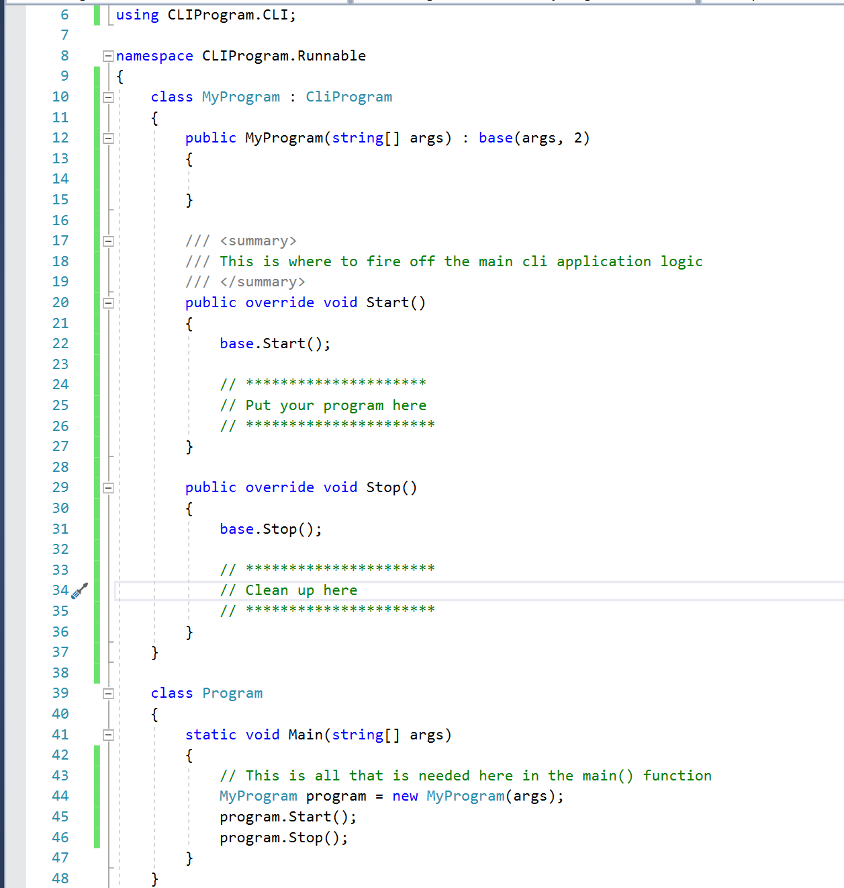

CLIProgram
==========

A simple Command Line Program framework to create an easy and consistent experience additing CLI support to programs

## How to Use

The purpose of this library is to create consistently architected CLI programs. Once the library is added to your project, the `CliProgram` class is meant to be inherited. Once a class is created to utilize the library, all that needs to happen in the `main()` function is:

```
MyProgram program = new MyProgram(args);
program.Start();
program.Stop();
```

## Initialize

Create a class, to represent your program and inherit this class. The only argument needed is this program args which
needs to be passed to it. The expected arguments to be given to the inherited constructor are the `cli args` and the
`minimum arguments allowed`. On program start, the number of args given will be counted.

## Method: Start()

This is the method which starts the cli application logic. This method is meant to be overridden to perform the
program's logic, however **the super method must be called**, otherwise the standard checks will be skipped.

The standard checks which occur, in order, are:
	- Argument list is not empty or nulled
	- Checks for version flags
	- Checks for help flags
	- Checks the argument list contains at least the minimum expected number of args

## Method: Stop()

This method will quit the program, with the exit code of `0`. It is also able to be overridden for if the user wants
to implement specific functionality.

## Internal Methods and Features

### Error

This is a special organizational class which is suppose to streamline error codes and methods. Querying the `ErrorCodes`
property will give a list all codes, both user created and default.

#### Method: addErrorCode(string message)

This method will add an error message to a dictionary of messages. It will return the actual integer code
assigned to it.

#### Method: quit(int code, int message = "")

This method will quit the application with the given error code. If the given error code exists in the error
code dictionary, it will display the associated message. If not the application will still quit.

The optional message argument will display before the dictionary's error code message.

### Settings

There is a settings class which contains various things including a copy of the passed `programming arguments`.
It also will store certain behavior settings for the cli program including:

- **Debug Mode** (*Default: false*): currently only effects to styling of error code on quit
- **QUIT_WITH_ERROR_MESSAGE** (*Default: true*): When application quits, the associated error message will be displayed
- **PAUSE_ON_QUIT** (*Default: false*): When application quits, the console will pause until a key
is pressed (not ideal for background tasks)

This also allows to get program specific information such as program name and version number

### Usage

This class will organize the usage documentation of the CLI application (aka - the help flag).

#### Method: addToHelp(string message)

This method will add a line to the help doc. This handles new line '\n' and will separate into their own lines.

## Example Code

